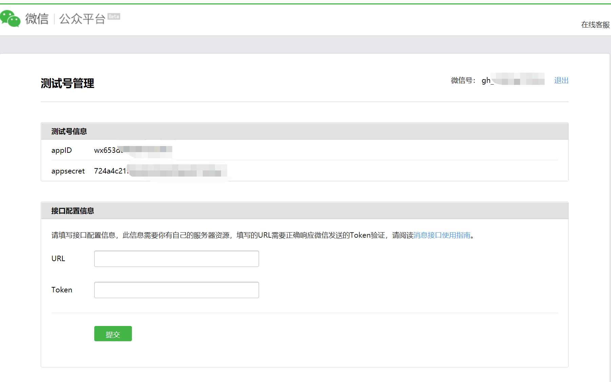
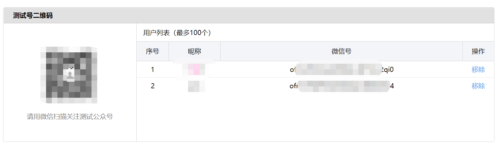
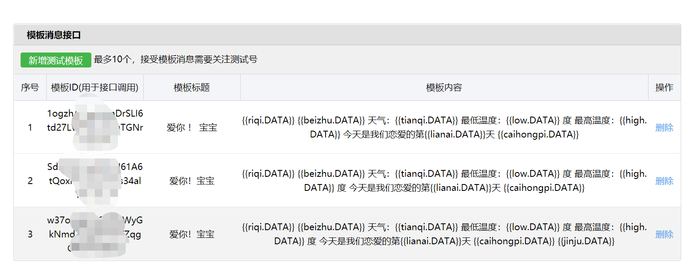

做一个程序员给女朋友的浪漫礼物吧。

最终效果


GitHub地址：

[https://github.com/ynwynw/weixinPush-public](https://github.com/ynwynw/weixinPush-public)

#### 所用知识点

1. springboot实现java后台

2. 微信测试账号的申请

3. 微信模版推送的配置

4. 接入百度天气api

5. 彩虹屁api或者自己写个情话库

6. 每日金句api或者自己写个金句库

## 一、springboot创建java后台

  Idea创建一个Springboot的maven工程


1.核心推送代码如下

```java

public class Pusher {
    private static String appId = "xxxx";
    private static String secret = "xxx";
 
    public static void push(String openId,String templateId){
        //1，配置
        WxMpInMemoryConfigStorage wxStorage = new WxMpInMemoryConfigStorage();
        wxStorage.setAppId(appId);
        wxStorage.setSecret(secret);
        WxMpService wxMpService = new WxMpServiceImpl();
        wxMpService.setWxMpConfigStorage(wxStorage);
        //2,推送消息
        WxMpTemplateMessage templateMessage = WxMpTemplateMessage.builder()
                .toUser(openId)
                .templateId(templateId)
                .build();
        //3,如果是正式版发送模版消息，这里需要配置你的信息
        JSONObject todayWeather = Tianqi.getNanjiTianqi();
        templateMessage.addData(new WxMpTemplateData("riqi",todayWeather.getString("date") + "  "+ todayWeather.getString("week"),"#00BFFF"));
        templateMessage.addData(new WxMpTemplateData("tianqi",todayWeather.getString("text_day"),"#00FFFF"));
        templateMessage.addData(new WxMpTemplateData("low",todayWeather.getString("low") + "","#173177"));
        templateMessage.addData(new WxMpTemplateData("high",todayWeather.getString("high")+ "","#FF6347" ));
        templateMessage.addData(new WxMpTemplateData("caihongpi",CaiHongPi.getCaiHongPi(),"#FF69B4"));
        templateMessage.addData(new WxMpTemplateData("lianai",JiNianRi.getLianAi()+"","#FF1493"));
        templateMessage.addData(new WxMpTemplateData("shengri",JiNianRi.getShengRi()+"","#FFA500"));
        templateMessage.addData(new WxMpTemplateData("jinju",CaiHongPi.getJinJu()+"","#C71585"));
        //templateMessage.addData(new WxMpTemplateData("jiehun",JiNianRi.getJieHun()+""));
        templateMessage.addData(new WxMpTemplateData("linzhen",JiNianRi.getLinZhen()+"","#FF6347"));
        String beizhu = "情人节快乐！";
        if(JiNianRi.getJieHun() % 365 == 0){
            beizhu = "今天是结婚纪念日！";
        }
        if(JiNianRi.getLianAi() % 365 == 0){
            beizhu = "今天是恋爱纪念日！";
        }
        if(JiNianRi.getLinZhen() % 365 == 0){
            beizhu = "今天是结婚纪念日！";
        }
        templateMessage.addData(new WxMpTemplateData("beizhu",beizhu,"#FF0000"));
 
        try {
            System.out.println(templateMessage.toJson());
            System.out.println(wxMpService.getTemplateMsgService().sendTemplateMsg(templateMessage));
        } catch (Exception e) {
            System.out.println("推送失败：" + e.getMessage());
            e.printStackTrace();
        }
    }
}
```


## 二、注册微信测试账号，并实现推送功能

正常我们企业开发，实现微信模版消息推送，必须要有微信公众号，[备案](https://cloud.tencent.com/product/ba?from=10680)的网址，并且最麻烦的一点是要获取到用户的openid，作为个人，这些条件基本上都不具备。所以今天就来带大家注册微信开发测试账号，来轻松实现微信模版消息推送。


1.微信扫码登录下面网址 [https://mp.weixin.qq.com/debug/cgi-bin/sandbox?t=sandbox/login](https://mp.weixin.qq.com/debug/cgi-bin/sandbox?t=sandbox/login) 扫码登录成功后，就会给我们生成微信公号的appid和appsecret




 2.微信扫码关注 测试号二维码，微信给我们返回我们的openid，这个openid在推送时特别重要。因为你推送肯定要知道推送给 谁啊，就比如你打电话，肯定要知道用户的电话号码吧。这个openid就是我们要推送给那个用户的唯一标示。




3.生成自己的模板




参数需以{{开头，以.DATA}}结尾 ，ex：{{caihongpi.DATA}}，代码里面替换就可以了

```java
templateMessage.addData(new WxMpTemplateData("caihongpi",CaiHongPi.getCaiHongPi(),"#FF69B4"));
```


4.拿到模板id，用户微信号id，就可以推送消息了


## 三、丰富功能

##### 1.接入百度天气api

[控制台 | 百度地图开放平台 (baidu.com)](https://lbsyun.baidu.com/apiconsole/center#/home)

注册百度开发者，申请开放百度天气的api。具体如何接入网上教程很多，可以自行百度

##### 2.接入彩虹屁的api或者自己开发一个彩虹屁库
[彩虹屁的api：天行数据TianAPI - 开发者API数据平台](https://www.tianapi.com/)

网上有一些调用彩虹屁库的api，或者自己写一堆情话放在文件里，读取到内存里，用当前的天数取模就可以了。每日金句同理


##### 3.纪念日计算

这里写了个粗略的计算方法，计算多少天。

```java
   public static int jiNianRi(String date) {
        int day = 0;
        try {
            long time = System.currentTimeMillis() - simpleDateFormat.parse(date).getTime();
            day = (int) (time / 86400000L);
        } catch (ParseException e) {
            e.printStackTrace();
        }
        return day;
    }
```


**4.定时任务**

写个定时任务每天早上7点半起床的时候推送

```java
  @Scheduled(cron = "0 0 7 * * ?")
    public void goodMorning(){
        Pusher.push(openId,templateId);
    }
```

